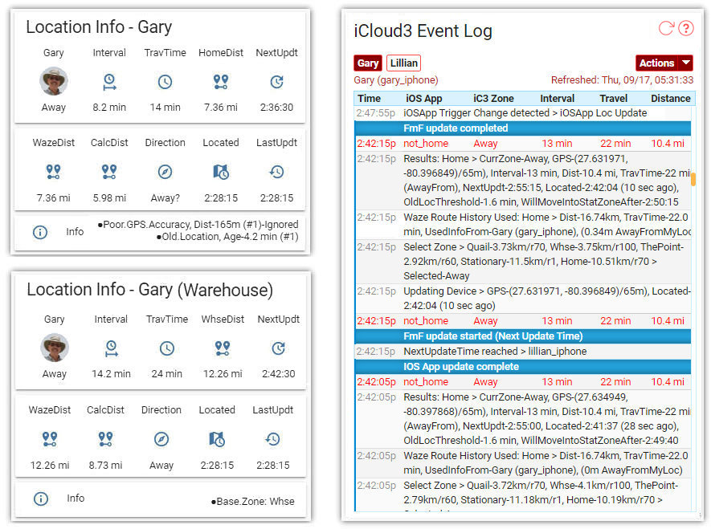

# Welcome to iCloud3 v2.0! readme.md

iCloud3 is a device_tracker custom_component for iPhones, iPads and iWatches. It is tightly integrated with the Home Assistant IOS App (versions 1 & 2), uses the Waze Route Tracker for distance and time information, creates Dynamic Stationary Zones when you are stationary, lets you monitor distance and time information for the home zone and other zones (wok, school, etc.), minimizes battery usage, and much more.

iCloud3 is a Home Assistant device tracker custom component that greatly expands the capabilities of the iCloud (and iCloud2) HA component. It exposes many new attributes, provides many new features, is based on enhanced route tracking methods, is much more accurate, and includes additional service calls.

### Features
* Supports three tracking methods, 
  * Find-my-Friends using the *Find My* app location data. This tracking method is used if you have set up 2fa security on your main iCloud account. This method will eliminate the constant notifications when a device has accessed your account.
  * Family Sharing will let you track your family members. This tracking method is used if you have not set up 2fa security on your Apple iCloud account.
  * Home Assistant IOS App (versions 1 & 2). This tracking method is used if the others are not available.
* A variable polling interval that is based on the Waze Route Mapping Service (drive time and distance) rather than just a calculated straight line distance.
* Monitors the IOS App device_tracker and sensors to immediately capture zone enter and exit notifications.
* Sensor templates are created that can be used in automations, in scripts and on Lovelace cards. The sensors that are created can be customized to suit your needs.
* Calculate distance and travel time for more than one zone.
* GPS wandering that randomly changes the device's state from home to not_home is eliminated.
* Short 15-second polling interval when you are less than 1 mi/km from home lets you reliably trigger automations based on an accurate distance.
* A Dynamic Stationary Zones is created when you are in the same location for while (doctors office, mall, school, restaurant, etc.) to conserve reduce device polling and battery life when you stationary.
* Old location data and GPS inaccuracy locations are automatically discarded.
* Additional service call commands (setting intervals, pausing and resuming polling, zone assignment, etc.)
* You no longer need any other program (other than the HA IOS app) to handle device tracking and presence detection. You will not need Nmap, OwnTracks, router based tracking components to name a few.
* New Configuration variables and Attributes let you customize how you want to use iCloud3.
* The iCloud3 Custom Card displays events to monitor tracking activity, interactions with the HA IOS App and to troubleshoot device and location issues.
* Extensive documentation on what iCloud3 does, how to set it up and how to customize it to meet your needs. It includes many sample automations and scripts that you can use to set your own device tracking and presence detection.

And much more ...

### iCloud3 Information Card & Event Log Custom Card

*Gary Cobb, aka GeeksterGary*
