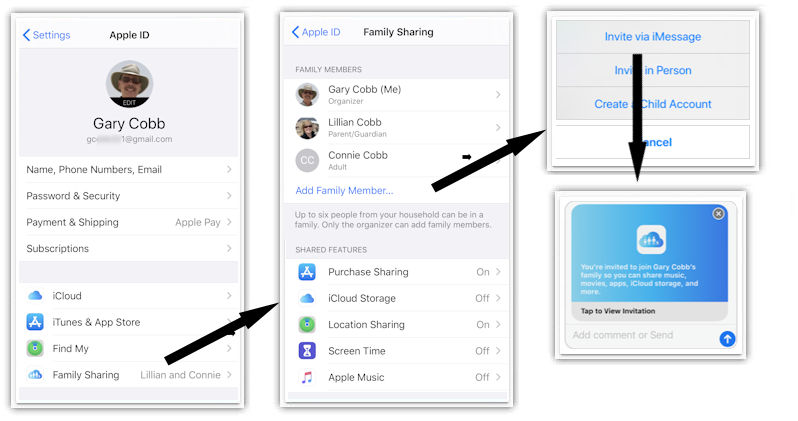

# Preparing for iCloud3

This chapter explains how to:

- Decide what tracking method you want to use.
- Set up iCloud account for the Find-My-Friends tracking method using the iPhone's FindMy App or for the Family Sharing tracking method using the iPhone's Settings App.

### iCloud3 Tracking Methods

The previous chapter described the tracking methods you can use.

- **Find-My-Friends (fmf)** - Uses the people that you are sharing your location with on the FindMy App. This is probably most efficient method to use in regards of how iCloud locates devices and lets you  track people that are not on your Family Sharing List.
- **Family Sharing (famshr)** - The people you want to track are on your Family Sharing list on your iCloud account, along with other Apple devices you don't want to track. Remember, when you use this tracking method, iCloud will locate all of the devices whether you are tracking them or not.

#### Find-My-Friends Tracking Method and the The FindMy app

The Find-my-Friends (FmF) tracking method locates the people you have set up on iPhone's ```FindMy App > People``` screen. When they are added, their iCloud account email address adds the phone to the *Share Location* list and is used on the iCloud3 track_devices parameter. 

The person's email address ties the phone being tracked on the iCloud3 track_devices parameter (*gary_iphone*)  to the person on the Share My Location list (*gary-icloud-acct@email.com*).

1. Open the FindMy App.
2. Select **People**. Then select **+ Share My Location**.
3. This will open the *Share My Location* popup window. Select the person to add to the list using their mobile phone number or their email address.
4. Select **Send** to send a sharing invitation to that person. 
5. Open the email requesting approval and the **Accept the invitation**. 
6. Verify that Location Sharing is on turned on their iPhone.


> Go to Apple the support web site [here](https://support.apple.com/en-us/HT210400) for more information on the FindMy App and go [here](https://support.apple.com/en-us/HT201493) for more information on setting up and using Find My Friends.

#### Family Sharing Tracking Method and the Settings App

The Family Sharing list is part of your iCloud account and set up on the Settings App.

1. Open the *Settings*.
2. Select  **Your Profile (Apple ID, iCloud, iTunes & App Store)****. 
3. This will open *Your Apple Profile* screen. 
4. Select **Family Sharing** to open the *Family Sharing* screen.
5. Select **Add Family Member** to open the *Invite via iMessage* popup window.
6. Select **Invite via iMessage**. They be added to the Family Sharing List after they accept the invitation. Verify that Location Sharing is turned on on their iPhone.



> Go to Apple the support web site [here](https://support.apple.com/en-us/HT201088) for more information on setting up  and using Family Sharing.

#### iCloud Verification Issues - Setup Find-my-Friends (FmF) with a non-2fa Account

Normally, your iCloud account is used for authentication. You go through the verification process discussed above, the people sharing your location with you are located and everything works as expected. Several months later, access to your account expires and you go through the verification process again.

However, there may be times when you go through the verification process, everything looks normal, the people sharing their location with you are located but iCloud asks for another verification several hours or weeks later. It's as if the access authorization to your account expires immediately. 

iCloud3 v2.1 solved this problem by creating a second non-2fa account, logging into that account and setting up the FindMy App and then using that account in the username/password configuration parameters. Since this account does not is not a 2fa account, it need to be verified. The following steps explain how to do this and how it will then tie everything together.

1. Add a new iCloud account with a different email address with 2fa turned off. You will use this email address in the *username/password* configuration parameter.

​        !> This is easier to set up if you do it on a device you will not be locating. 

​        !> iOS 13+ turns on 2fa automatically and it can not be turned off. The non-2fa account should be added on a computer instead of an iPhone or iPad.

2. Since this is a different iCloud account, add the people that use the devices you want to track in the `Contacts` app You only need to enter their name and the email address of their actual iCloud account. 

​        !> Only one device can be tracked for each email address. You can not track both an iPhone and an iPad used by the same person.

3. Follow the procedures in the *Find-My-Friends Tracking Method and the The FindMy app* paragraph above to add the people you want to track in the FindMy App on this non-2fa account.
4. Verify that the Find My app and your iCloud account at icloud.com can locate your the people you are tracking before continuing to set up iCloud3. They should be displayed on the map in the app when signed into the new non-2fa account and the 'Sharing With ...'  message should be displayed in the app when you are signed into the 2fa account. 

​        !> **If the devices can not be seen in the app, they will not be located by iCloud3.**

5. Now that you have verified that everything is set up correctly, sign out of the non-2fa account and sign back into your 2fa account. You will only need to sign back into the non-2fa account if you want to track another device.


*Overview of how iCloud3 uses the people's contact information to link the iCloud location to the tracked device*

